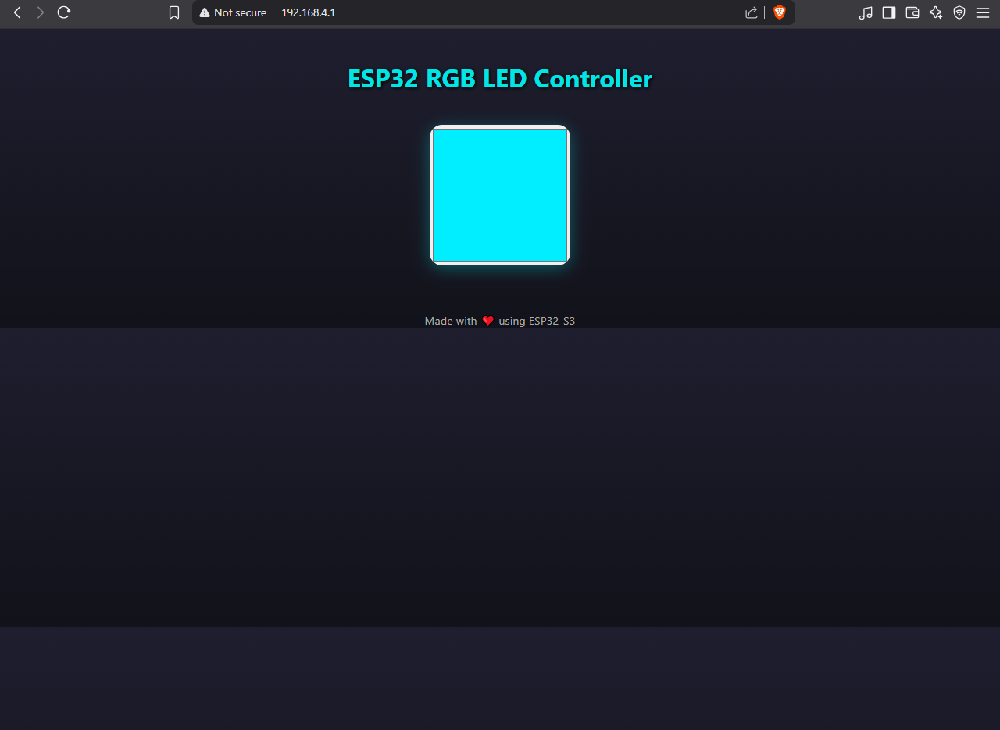
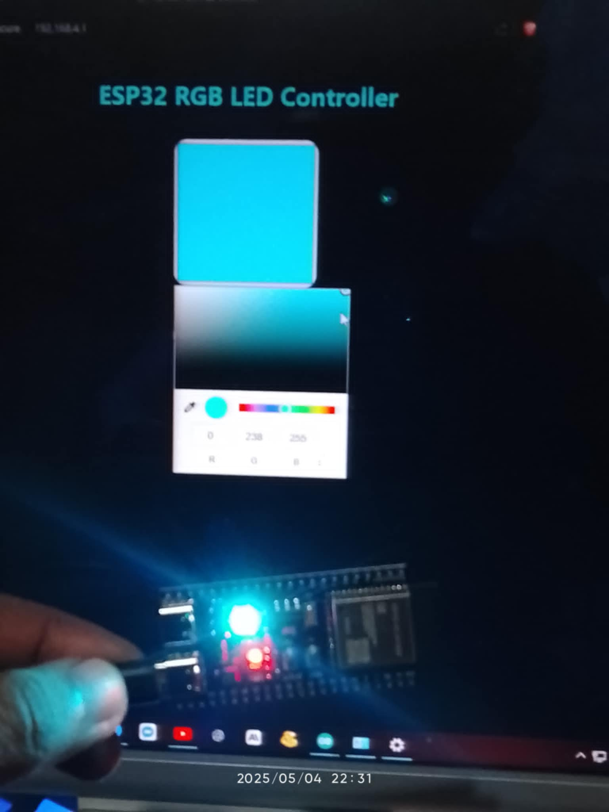

# ESP32-S3 RGB LED Web Controller (Access Point Mode)

Control the **built-in RGB LED** of your ESP32-S3 DevKit over Wi-Fi using a **self-hosted web interface**. This project sets up the ESP32-S3 as a Wi-Fi **Access Point**, serves a sleek **HTML color picker**, and updates the RGB LED in real time based on your selection.

---

## 🚀 Features

- 📶 Access Point mode — no internet or router needed
- 🎨 HTML5 color picker with live preview
- 💡 Real-time LED color updates (AJAX)
- 📱 Mobile & Desktop friendly UI
- 🧠 Purely hosted from the ESP32 — no external files
- 🌐 Lightweight web server using ESP32 WebServer library

---
## 🔧 Hardware Requirements

- ✅ ESP32-S3 DevKit (with built-in RGB LED, usually on **GPIO 48**)
- ✅ USB cable
- ✅ Arduino IDE with ESP32 board support
- ✅ [Adafruit NeoPixel library](https://github.com/adafruit/Adafruit_NeoPixel)

---

## 🛠️ Setup Instructions

1. **Connect** your ESP32-S3 to your PC.
2. **Install** the "[Adafruit NeoPixel library](https://github.com/adafruit/Adafruit_NeoPixel)" library via Arduino Library Manager.
3. **Upload** the sketch provided in this repo to your board.
4. Open **Serial Monitor** (115200 baud) to get the IP address (`192.168.4.1`).
5. Connect to the Wi-Fi network:
   - SSID: `ESP32_RGB_Control`
   - Password: `12345678`
6. Open a browser and go to `http://192.168.4.1`.

---

## 📸 Screenshots

### 🎨 Web UI Interface
> Color picker with responsive layout

### 💡 Real-time LED Control
> LED reflects selected color instantly

---

## 📃 License

This project is licensed under the MIT License. Free to use and modify.  
**Credits:** [Adafruit NeoPixel Library](https://github.com/adafruit/Adafruit_NeoPixel)

---

## ❤️ Made With

- ESP32-S3 DevKit
- Arduino IDE
- HTML + CSS + JS
- Time and Coffee ☕
